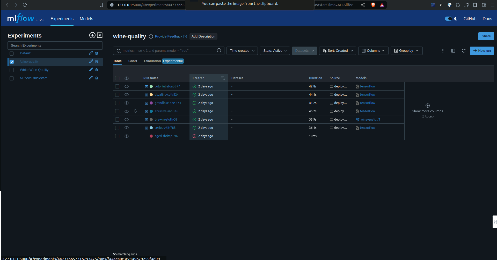

# [MLflow](https://mlflow.org/#core-concepts) Experiments
## Introductory Experiments with the MLFlow Platform

  

### Some resources I would definitly prefer to go through
a. [MLFlow Docs](https://mlflow.org/docs/latest/index.html)  
b. [MLFlow Quick Start](https://mlflow.org/docs/latest/getting-started/intro-quickstart/index.html)  
c. [Examples](https://mlflow.org/docs/latest/getting-started/logging-first-model/index.html)  
d. [Automatic Logging](https://mlflow.org/docs/latest/tracking/autolog.html)  
e. [Quick Start for Deployment](https://mlflow.org/docs/latest/getting-started/quickstart-2/index.html)  

### Youtube Tutorials  
a. [The Power Of MLFLOW And Dagshub-Open Source Data Science Project Collaboration](https://www.youtube.com/watch?v=qdcHHrsXA48)  
b. [Build ML Production Grade Projects For Free | MLOps Course For Beginners](https://www.youtube.com/watch?v=dPmH3G9NQtY)  
c. [01. Introduction To MLflow | Track Your Machine Learning Experiments | MLOps](https://www.youtube.com/watch?v=ksYIVDue8ak)  